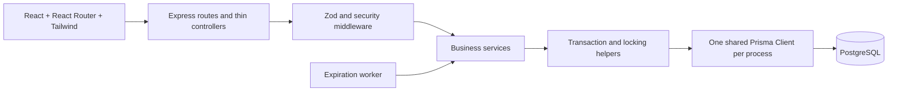
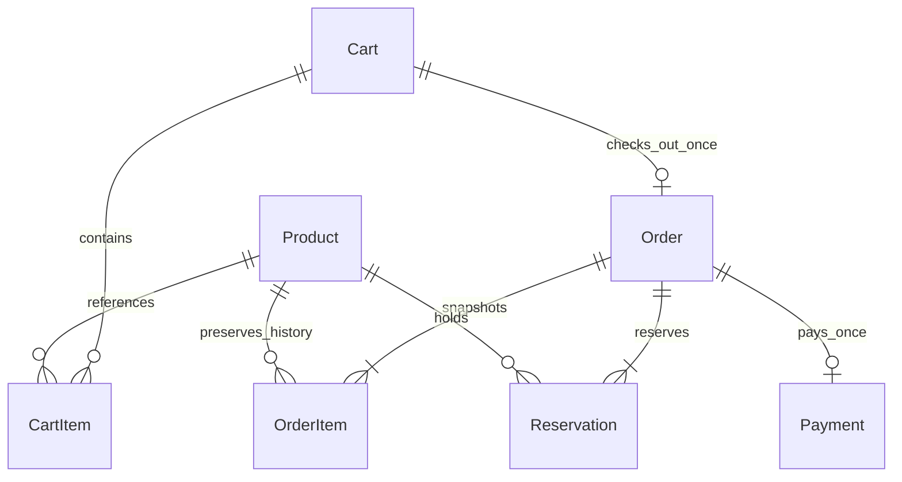
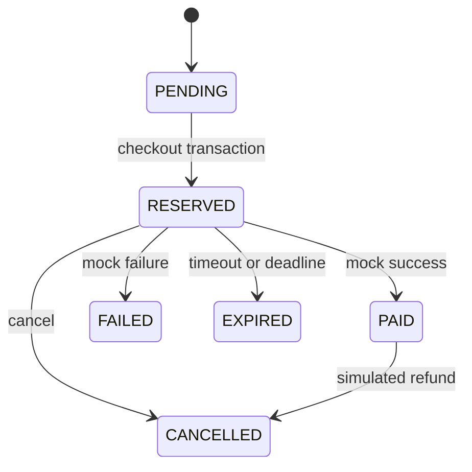

# Counter · POS Order & Inventory System

**Concurrency-safe order processing, built for an internship assessment.**

Counter is a React point-of-sale workspace backed by Express, Prisma and PostgreSQL. The database protects inventory when many customers reserve the same product, retry payment, cancel orders, or race against reservation expiry.

## Quick start

Prerequisites: Node.js 22.12+ (tested locally on Node 24 and in Docker on Node 22), npm, Docker with Compose.

Run from the repository root:

```sh
npm ci
npm run setup
docker compose up -d --wait db
npm run db:generate
npm run db:migrate
npm run db:seed
npm run dev
```

Open the frontend URL printed by Vite. The example configuration uses [localhost:5173](http://localhost:5173), with the API at [localhost:4000/api/health](http://localhost:4000/api/health).

`npm run setup` generates random local database credentials and a staff key, creates ignored environment files, and **preserves any existing files**. Review ports if a local service already uses them. The current workspace's generated configuration uses PostgreSQL port **5438**.

No database password or staff key belongs in source control. Only configuration templates are committed. The seed is repeatable: it inserts missing products without resetting live stock or prices.

### Commands

| Command                   | Purpose                                                 |
| ------------------------- | ------------------------------------------------------- |
| `npm run setup`           | Generate local configuration, preserving existing files |
| `npm run dev`             | Start API and Vite with live reload                     |
| `npm run db:generate`     | Generate Prisma Client                                  |
| `npm run db:migrate`      | Apply versioned production-safe migrations              |
| `npm run db:test:migrate` | Apply migrations to the dedicated test database         |
| `npm run db:seed`         | Add the six initial products                            |
| `npm test`                | Run unit tests without a database                       |
| `npm run test:db`         | Run real PostgreSQL API and concurrency tests           |
| `npm run lint`            | Check source with ESLint                                |
| `npm run format:check`    | Verify formatting                                       |
| `npm run format`          | Apply Prettier                                          |
| `npm run build`           | Generate/check backend and compile the frontend         |

Scripts invoke CLI JavaScript through Node directly so Windows paths containing spaces and ampersands work.

## Architecture



- `backend/src/controllers`: validate request boundaries and format responses.
- `backend/src/services`: products, carts, checkout, inventory settlement, orders and mock payment.
- `backend/src/repositories`: parameterized row locks, database clock, bounded transaction retry.
- `backend/src/constants/lifecycle.js`: the single allowed-transition definition.
- `backend/src/jobs`: periodic, non-overlapping expiration batches.
- `backend/prisma`: schema, SQL migrations, constraints and idempotent seed.
- `backend/tests`: unit, API integration and concurrency suites.
- `frontend/src`: pages, shared components, layout, API client, state and polling.
- `docs`: deployment, verification, and technical interview notes.

JavaScript ES modules are used throughout, following the stack's stated JavaScript preference. There is no TypeScript compilation claim: backend build checks JavaScript syntax; Zod validates runtime inputs; Prisma generates the typed client.

## Database design



| Entity      | Important rules                                                                                     |
| ----------- | --------------------------------------------------------------------------------------------------- |
| Product     | Integer price in minor units; available stock ≥ 0; soft deletion; version for stale-edit protection |
| Cart        | ACTIVE or CHECKED_OUT; cart row serializes edits and checkout                                       |
| CartItem    | Unique cart/product pair; positive quantity, at most 1,000                                          |
| Order       | Unique cart ID; nonnegative integer total; explicit lifecycle                                       |
| OrderItem   | Name and price snapshots; positive quantity; database verifies subtotal = unit price × quantity     |
| Reservation | Unique order/product pair; quantity > 0; exact five-minute interval enforced by CHECK               |
| Payment     | Unique order ID AND globally unique UUID idempotency key; stores requested mock outcome             |

Foreign keys use RESTRICT for historical orders, reservations, payments, and products. Cart items can cascade only with cart deletion; there is no cart-deletion endpoint. Deactivating a product preserves order history and blocks future reservations.

Maximum API product price is 100,000,000 minor units, available-stock input is 1,000,000, cart quantity is 1,000 per item, and carts have at most 100 distinct items. Checkout rejects totals above the PostgreSQL signed integer limit. Arithmetic uses integer values; the browser parses decimal product-price text into minor units.

## Inventory model

`Product.stock` means **currently available** units.

| Event for a two-unit order starting with stock 10 | Available stock | Reservation |
| ------------------------------------------------- | --------------: | ----------- |
| Add to cart                                       |              10 | None        |
| Checkout commits                                  |               8 | ACTIVE      |
| Successful payment                                |               8 | CONSUMED    |
| Failure or reserved cancellation                  |              10 | RELEASED    |
| Timeout or expiry                                 |              10 | EXPIRED     |
| Paid cancellation, simulated refund               |              10 | RELEASED    |

Only one terminal path can restore a reservation. All stock increments live in `settleReservations`, which checks the previous reservation state. Paid cancellation explicitly permits CONSUMED → RELEASED once.

Staff can set available stock, but PATCH requests containing `stock` must include `expectedVersion` from GET Product. Checkout, restoration and product updates increment that version. A stale editor receives `409 STALE_PRODUCT` instead of overwriting a concurrent reservation. Changing the available count is an explicit stock correction; it does not overwrite held reservation quantities.

## Checkout transaction and overselling protection

```mermaid
sequenceDiagram
  participant C as Customer
  participant A as API
  participant D as PostgreSQL
  C->>A: POST cart checkout
  A->>D: BEGIN
  A->>D: Lock cart FOR UPDATE
  A->>D: Return existing order if present
  A->>D: Load cart items
  A->>D: Lock product rows ORDER BY id FOR UPDATE
  A->>D: Recheck active status and stock
  alt Any product unavailable
    A->>D: ROLLBACK
    A-->>C: 409 INSUFFICIENT_STOCK
  else All available
    A->>D: Decrement available stock
    A->>D: Create PENDING order and price snapshots
    A->>D: Create ACTIVE reservations with exact five-minute expiry
    A->>D: Cart CHECKED_OUT; order RESERVED
    A->>D: COMMIT
    A-->>C: Order and reservation deadline
  end
```

A competing transaction waits on the same product row and then reads the committed stock under READ COMMITTED isolation. It cannot reserve units that the first transaction removed. The database stock CHECK is a second line of defense.

All products are locked in ascending UUID order, including during restoration. Every cart write first locks its parent cart. Order payment, cancellation, and expiry all lock their parent order before settling reservations. No JavaScript mutex is used, so correctness holds across multiple API instances.

Interactive transactions include every stock and status write. An injected database trigger in the integration suite forces order insertion to fail after deduction; the test confirms that the stock deduction, cart changes and all partial records roll back.

Transient deadlocks/serialization errors retry at most twice with short jitter. Business conflicts are not retried. Prisma transaction limits bound lock/connection waits; responses never expose SQL.

## Order and reservation lifecycle



PENDING exists inside the checkout transaction. A successful response exposes RESERVED, and a rollback leaves no pending order. All order transitions call the shared validator. FAILED, EXPIRED and CANCELLED cannot become PAID.

Reservation transitions:

- ACTIVE → CONSUMED: payment success; no second deduction.
- ACTIVE → RELEASED: payment failure or reserved cancellation.
- ACTIVE → EXPIRED: deadline or mock timeout.
- CONSUMED → RELEASED: paid-order cancellation only.

### Expiration

All reservation rows for an order share a database-derived creation timestamp and expire exactly 300,000 ms later. The SQL CHECK enforces this interval. The worker polls every 15 seconds by default, processing 100 due orders per batch. Multiple workers may run safely; each locks and rechecks the order, so repeat processing cannot restore twice.

The deadline is exact; physical restoration happens when the worker or a lazy check processes it, normally within one polling interval under light load. Backlogs can delay cleanup. A stopped API also stops its worker; pending work is processed on restart.

GET order, order lists, dashboard recent-order reads, payment and cancellation perform lazy expiration. A late payment is rejected and inventory restoration is committed first. **An exception is not thrown inside the expiration transaction**, because that would undo restoration.

Expiry checks use PostgreSQL `clock_timestamp()` **after acquiring the order lock**. `CURRENT_TIMESTAMP` is fixed at transaction start and could incorrectly accept a request that waited past expiry. The frontend timer is only a visual estimate and is not used for authorization.

### Payment and idempotency

```http
POST /api/orders/{orderId}/pay
Content-Type: application/json
Idempotency-Key: <new UUID for this payment intent>

{"outcome":"success"}
```

Supported outcomes are `success`, `failure`, and `timeout`. Explicit outcome selection is strictly a mock-gateway feature.

1. Lock the idempotency key using a transaction-scoped PostgreSQL advisory lock.
2. Lock the order.
3. If the key exists, verify the same order and outcome; return the original Payment record and current order state.
4. Otherwise perform lazy expiry and verify RESERVED with ACTIVE reservations.
5. Create the payment and settle reservations atomically.

The advisory lock handles simultaneous cross-order key reuse; uniqueness constraints remain the final guarantee. Hash collisions can only serialize unrelated keys, not corrupt their identity. A unique Payment.orderId means this demo supports one payment attempt per order; a failed order requires a new cart.

Failure and timeout are successful **mock operations**, so their results return HTTP 200 with Payment.status FAILED or TIMEOUT. Invalid business actions return 409. A repeated request with a new key after completion gets a conflict. Changed payloads with an old key get `IDEMPOTENCY_KEY_REUSED`.

The frontend stores an unresolved payment intent in sessionStorage and retries with the same key. It never stores staff keys there. A paid cancellation leaves the original payment SUCCESS as historical evidence and changes Order to CANCELLED; there is no real gateway refund.

## API

All success responses use `{ "success": true, "data": ... }`; errors use `{ "success": false, "error": { "code", "message" }, "requestId" }`.

| Method | Endpoint                     | Body / behavior                                                            |
| ------ | ---------------------------- | -------------------------------------------------------------------------- |
| GET    | /api/health                  | Database readiness; 503 if unavailable                                     |
| GET    | /api/dashboard               | Active products, available stock, active reservation orders, recent orders |
| GET    | /api/products                | Products including archived, bounded to 1,000                              |
| GET    | /api/products/:id            | Product with available stock and version                                   |
| POST   | /api/products                | name, description?, integer price, integer stock, isActive?                |
| PATCH  | /api/products/:id            | Partial product fields; expectedVersion required with stock                |
| DELETE | /api/products/:id            | Soft-deactivate                                                            |
| POST   | /api/carts                   | Create ACTIVE cart                                                         |
| GET    | /api/carts/:id               | Items, trusted current prices and calculated totals                        |
| POST   | /api/carts/:id/items         | productId, quantity; increment an existing cart line                       |
| PATCH  | /api/carts/:id/items/:itemId | quantity                                                                   |
| DELETE | /api/carts/:id/items/:itemId | Remove cart line                                                           |
| POST   | /api/carts/:id/checkout      | Reserve atomically, or return existing order                               |
| GET    | /api/orders?page=1&limit=20  | Paginated orders; limit capped at 100                                      |
| GET    | /api/orders/:id              | Items, reservations, payment, lazy expiry                                  |
| POST   | /api/orders/:id/pay          | outcome; UUID Idempotency-Key header                                       |
| POST   | /api/orders/:id/cancel       | Cancel RESERVED/PAID; repeat cancellation is idempotent                    |

Example product creation:

```json
{
  "name": "Wireless Mouse",
  "description": "Quiet, wireless precision.",
  "price": 4900,
  "stock": 20
}
```

Production product mutations require `X-Admin-Key`. Staff can enter this server-managed key in the UI's **Staff access settings**. Do not set it as a VITE variable.

Errors include INVALID_INPUT (422), INVALID_JSON (400), PRODUCT_NOT_FOUND/CART_NOT_FOUND/ORDER_NOT_FOUND (404), INSUFFICIENT_STOCK/STALE_PRODUCT/EMPTY_CART/RESERVATION_EXPIRED/INVALID_ORDER_TRANSITION/IDEMPOTENCY_KEY_REUSED (409), UNAUTHORIZED (401), RATE_LIMITED (429), PAYLOAD_TOO_LARGE (413), and DATABASE_BUSY (503).

## Configuration

| Variable           | Meaning                                                                     |
| ------------------ | --------------------------------------------------------------------------- |
| DATABASE_URL       | Server-only PostgreSQL URL; include provider-required SSL and pool settings |
| TEST_DATABASE_URL  | Dedicated database whose name ends in `_test`; reset by tests               |
| PORT               | Required API listen port                                                    |
| NODE_ENV           | development, test or production                                             |
| FRONTEND_URL       | One exact allowed browser origin                                            |
| ADMIN_API_KEY      | At least 32 characters in production; optional local development protection |
| EXPIRY_INTERVAL_MS | Worker cadence, 1–30 seconds; default 15 seconds                            |
| RATE_LIMIT_MAX     | Sensitive mutation requests per IP per minute; default 300                  |
| TRUST_PROXY        | Exact trusted reverse-proxy hop count; default 0                            |
| LOG_LEVEL          | silent, error, warn, info or debug                                          |
| VITE_API_URL       | Public API base URL ending in /api, compiled into the frontend              |
| VITE_PORT          | Local Vite port                                                             |
| VITE_CURRENCY      | Display currency; one currency for the entire demo                          |

Root Compose settings configure PostgreSQL, frontend/backend port mappings, container database URL and staff key. Internal PostgreSQL uses its standard container port; all host ports are configurable.

## Security and reliability

- Strict Zod objects reject browser-supplied totals, status changes, malformed IDs, negative/fractional inventory and unknown fields.
- Prisma parameterized APIs are used for all application SQL. Fixed-string DDL in the disposable rollback test is the only use of an Unsafe API.
- Helmet, disabled powered-by, exact CORS origin, 16 KB JSON limit, request IDs and centralized safe errors.
- Rate limits cover all API traffic, with a stricter shared limit on mutations.
- Staff product mutations are protected with constant-time key comparison in production.
- Structured checkout/payment/cancel/expiry/error logs omit request headers and credentials.
- One shared Prisma pool per process; bounded transactions; graceful worker/HTTP/database shutdown.
- GET health verifies database connectivity without exposing configuration.
- Containers run as non-root users. Secrets are injected at runtime and excluded from build context.
- Frontend renders React text; no dangerouslySetInnerHTML.

This is a **shared assessment sandbox**, not a multi-tenant retail service. Cart/order endpoints deliberately have no customer authentication or ownership checks, and mock outcome buttons are public. Use synthetic data only in a public assessment deployment. A real store needs authenticated users, roles, ownership checks, gateway webhooks and verified refunds. CORS does not provide authorization.

## Testing

Create the dedicated test database after the local PostgreSQL container starts:

```sh
docker compose exec -T db createdb -U pos pos_test
npm run db:test:migrate
npm test
npm run test:db
npm run lint
npm run format:check
npm run build
```

If you changed the generated PostgreSQL user/database names, adjust `createdb` accordingly.

Database tests refuse to run without TEST_DATABASE_URL ending in `_test`. They delete records from that dedicated database before each test. They never substitute an in-memory database for PostgreSQL. Files run sequentially to isolate fixtures; each concurrency case launches simultaneous HTTP requests through Supertest.

Coverage includes product/cart validation and CRUD, empty and insufficient-stock carts, immutable snapshots, exact expiry, duplicate checkout, duplicate same/different-key payments, cross-order key reuse, payment outcomes, repeated cancellations, expiry races, a blocked late payment, opposite product lock orders, stale stock edits, concurrent cart edits, raw database checks, and injected transactional rollback.

See [verification evidence](docs/VERIFICATION.md) and [technical summary](docs/TECHNICAL_SUMMARY.md). CI runs migrations, seed, lint, formatting, unit/integration/concurrency tests, builds and the production dependency audit against PostgreSQL.

## Docker and deployment

```sh
npm run setup
docker compose --profile app up -d --build --wait
docker compose exec -T backend node prisma/seed.js
```

Compose's frontend defaults to [localhost:8080](http://localhost:8080). Stop an existing local API using the same host port before starting the container. Keep the generated `.env` values aligned with the actual browser origin and public API URL.

The React static build, API container and PostgreSQL database can be hosted independently. See [deployment instructions](docs/DEPLOYMENT.md) for runtime variables, SSL, pooling, migrations, health checks and SPA routing.

**Public deployment status:** deployment configuration is supplied and locally verified; no cloud account or live public URL is configured in this workspace.

## Design trade-offs and next steps

- READ COMMITTED plus explicit row locks keeps the critical path understandable and avoids unnecessary serialization failures.
- Stock is reserved by immediate deduction, then either consumed or restored. This makes available stock simple to query.
- Price/name snapshots protect history without requiring immutable products.
- Five-minute validity is exact; periodic restoration is eventually processed, not a precise wall-clock scheduler.
- Workers contend on orders safely; a queue with SKIP LOCKED batching would improve very large workloads.
- Product listing is bounded to 1,000 and order filters apply to the displayed page. Server-side catalog search/filtering is a future extension.
- Polling keeps the UI simple; server-sent events can reduce refresh latency.
- Rate limiting is per process. A shared Redis store is appropriate for a horizontally scaled public API.
- Stock adjustments are version-checked absolute corrections. A full inventory ledger, audit events, purchase orders, tax rules, discounts, and real refunds are future work.
- Operational hardening should add identity, backups/restore drills, metrics, alerts, continuous dependency review, deployment-specific network controls and load tests at target scale.

### Reference documentation

The locking implementation uses [Prisma interactive transactions](https://www.prisma.io/docs/orm/v6/prisma-client/queries/transactions). The frontend build follows [Vite's Node.js requirements](https://vite.dev/guide/).

## Deploy task-01 on Render

Follow the [step-by-step Render guide](docs/RENDER_GUIDE.md). The local Compose project name is pinned to preserve the existing database when the folder is renamed.
