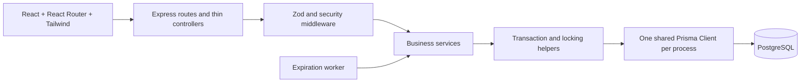
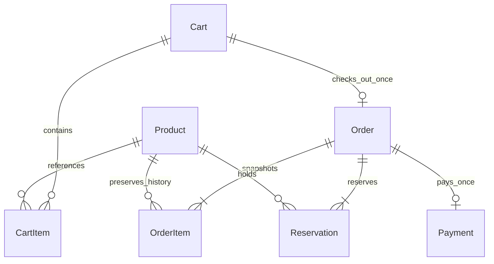
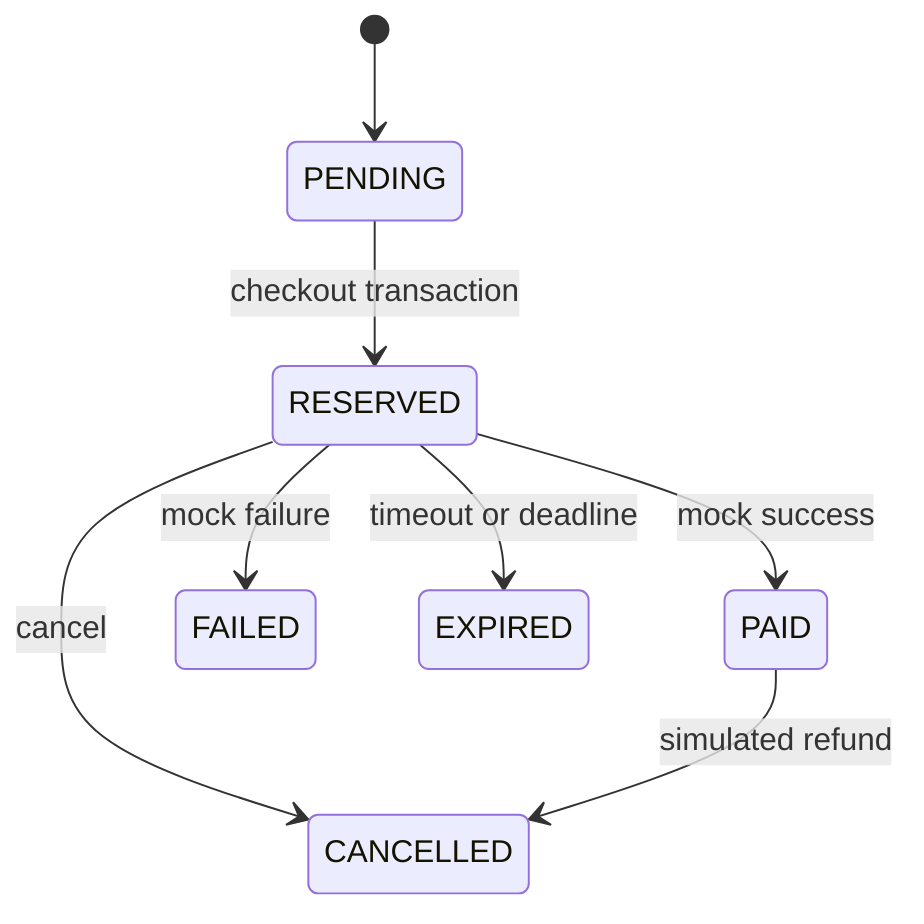

# Counter · POS Order & Inventory System

**Concurrency-safe order processing, built for an internship assessment.**

Counter is a React point-of-sale workspace backed by Express, Prisma and PostgreSQL. The database protects inventory when many customers reserve the same product, retry payment, cancel orders, or race against reservation expiry.

## Tech stack

| Area             | Technologies                                                         |
| ---------------- | -------------------------------------------------------------------- |
| Language/runtime | JavaScript ES modules, Node.js 22.12+                                |
| Frontend         | React 19, Vite 7, React Router 7, Tailwind CSS 4, Lucide icons       |
| Backend          | Express 5, Prisma 6, Zod 4                                           |
| Database         | PostgreSQL 17; native binaries via embedded-postgres for development |
| Security/logging | Helmet, CORS, express-rate-limit, Pino                               |
| Tests/quality    | Vitest 4, Supertest, ESLint 9, Prettier 3                            |
| Tooling          | npm workspaces, concurrently, GitHub Actions                         |

Exact resolved versions are in package-lock.json. Docker is not required.

## Quick start

Prerequisites: Node.js 22.12+ and npm. Development dependencies include native PostgreSQL 17 binaries. No PostgreSQL account or separate installation is needed locally.

Run from the application root: the `task-01` directory containing `package.json`, `backend`, and `frontend`. If cloning the current parent repository, change into `task-01` first. On Windows PowerShell, use `npm.cmd` in place of `npm` in these commands.

```sh
npm ci
npm run setup
npm run db:start
npm run db:generate
npm run db:migrate
npm run db:seed
npm run dev
```

Open the frontend URL printed by Vite. The example configuration uses [localhost:5173](http://localhost:5173), with the API at [localhost:4000/api/health](http://localhost:4000/api/health).

`npm run setup` generates random local database credentials, creates ignored environment files, and **preserves any existing files**. Review ports if a local service already uses them. The current workspace's generated configuration uses PostgreSQL port **5439**.

No database password or staff key belongs in source control. Only configuration templates are committed. The seed is repeatable: it inserts missing products without resetting live stock or prices.

Stop the app with Ctrl+C. Stop PostgreSQL with npm run db:stop; check it with npm run db:status. Restarting preserves data.

The installation, configuration, migration and seed steps above are for first-time setup. After setup, start a normal development session with just `npm run dev`. After pulling updates, install changed dependencies and apply new migrations as needed.

### Stopping and troubleshooting local development

1. Press **Ctrl+C** in the terminal running the app. If Windows asks `Terminate batch job (Y/N)?`, enter **Y**.
2. Optionally run `npm run db:stop` to stop PostgreSQL too. Database files remain in `.local/postgres/data`.
3. On the next run, `npm run dev` automatically checks/starts PostgreSQL before launching the API and frontend.

Run only one development instance. `Port 5173 is already in use` or API `EADDRINUSE` means another process owns the port; stop the previous project terminal before trying again. Do not start the combined root command while separate backend/frontend terminals are running. The combined command uses `concurrently --kill-others`, so when either child command exits, its companion is stopped too.

For database connection errors, run `npm run db:status` and inspect `.local/postgres/server.log`. The startup script checks the actual database connection before launching another server, verifies that it belongs to this project's data directory, and uses `pg_ctl` for background startup. Do not delete the data directory or PID files to fix a startup error.

`npm run dev` now runs a database startup check automatically before launching the API and frontend. Startup verifies the actual local database connection before considering another server launch, and uses PostgreSQL's `pg_ctl` background launcher. Stopping the app does not stop the database. Cloud deployments use `npm run start -w backend`, not this local development command.

### Run frontend and backend separately

Complete the Quick start commands through db:seed once. For later runs, start PostgreSQL from the project root:

```sh
npm run db:start
```

Open two terminals in the project root.

**Terminal 1 — backend:**

```sh
cd backend
npm run dev
```

**Terminal 2 — frontend:**

```sh
cd frontend
npm run dev
```

The root npm run dev command starts both apps with concurrently. Use one approach at a time to avoid port conflicts. On Windows, use npm.cmd instead of npm if PowerShell blocks npm.ps1.

Stop the app terminals with Ctrl+C. From the root, npm run db:stop stops PostgreSQL while preserving data, and npm run db:status checks it.

Before running db:generate or build on Windows, stop the backend and finish database tests: running Prisma processes can lock the generated DLL.

### Commands

| Command                   | Purpose                                                 |
| ------------------------- | ------------------------------------------------------- |
| `npm run setup`           | Generate local configuration, preserving existing files |
| `npm run dev`             | Check/start local PostgreSQL, then start API and Vite   |
| `npm run db:start`        | Start or reuse this project's local PostgreSQL          |
| `npm run db:status`       | Check the local PostgreSQL server                       |
| `npm run db:stop`         | Stop PostgreSQL while preserving its data               |
| `npm run db:generate`     | Generate Prisma Client                                  |
| `npm run db:migrate`      | Apply versioned production-safe migrations              |
| `npm run db:test:migrate` | Apply migrations to the dedicated test database         |
| `npm run db:seed`         | Add the six initial products                            |
| `npm test`                | Run unit tests without a database                       |
| `npm run test:db`         | Run real PostgreSQL API and concurrency tests           |
| `npm run lint`            | Check source with ESLint                                |
| `npm run format:check`    | Verify formatting                                       |
| `npm run format`          | Apply Prettier                                          |
| `npm run build`           | Generate/check backend and compile the frontend         |

Scripts invoke CLI JavaScript through Node directly so Windows paths containing spaces and ampersands work.

## Architecture



- `backend/src/controllers`: validate request boundaries and format responses.
- `backend/src/services`: products, carts, checkout, inventory settlement, orders and mock payment.
- `backend/src/repositories`: parameterized row locks, database clock, bounded transaction retry.
- `backend/src/constants/lifecycle.js`: the single allowed-transition definition.
- `backend/src/jobs`: periodic, non-overlapping expiration batches.
- `backend/prisma`: schema, SQL migrations, constraints and idempotent seed.
- `backend/tests`: unit, API integration and concurrency suites.
- `frontend/src`: pages, shared components, layout, API client, state and polling.
- `docs`: deployment, verification, and technical interview notes.

JavaScript ES modules are used throughout, following the stack's stated JavaScript preference. There is no TypeScript compilation claim: backend build checks JavaScript syntax; Zod validates runtime inputs; Prisma generates the typed client.

## Database design



| Entity      | Important rules                                                                                     |
| ----------- | --------------------------------------------------------------------------------------------------- |
| Product     | Integer price in minor units; available stock ≥ 0; soft deletion; version for stale-edit protection |
| Cart        | ACTIVE or CHECKED_OUT; cart row serializes edits and checkout                                       |
| CartItem    | Unique cart/product pair; positive quantity, at most 1,000                                          |
| Order       | Unique cart ID; nonnegative integer total; explicit lifecycle                                       |
| OrderItem   | Name and price snapshots; positive quantity; database verifies subtotal = unit price × quantity     |
| Reservation | Unique order/product pair; quantity > 0; exact five-minute interval enforced by CHECK               |
| Payment     | Unique order ID AND globally unique UUID idempotency key; stores requested mock outcome             |

Foreign keys use RESTRICT for historical orders, reservations, payments, and products. Cart items can cascade only with cart deletion; there is no cart-deletion endpoint. Deactivating a product preserves order history and blocks future reservations.

Maximum API product price is 100,000,000 minor units, available-stock input is 1,000,000, cart quantity is 1,000 per item, and carts have at most 100 distinct items. Checkout rejects totals above the PostgreSQL signed integer limit. Arithmetic uses integer values; the browser parses decimal product-price text into minor units.

## Inventory model

`Product.stock` means **currently available** units.

| Event for a two-unit order starting with stock 10 | Available stock | Reservation |
| ------------------------------------------------- | --------------: | ----------- |
| Add to cart                                       |              10 | None        |
| Checkout commits                                  |               8 | ACTIVE      |
| Successful payment                                |               8 | CONSUMED    |
| Failure or reserved cancellation                  |              10 | RELEASED    |
| Timeout or expiry                                 |              10 | EXPIRED     |
| Paid cancellation, simulated refund               |              10 | RELEASED    |

Only one terminal path can restore a reservation. All stock increments live in `settleReservations`, which checks the previous reservation state. Paid cancellation explicitly permits CONSUMED → RELEASED once.

Staff can set available stock, but PATCH requests containing `stock` must include `expectedVersion` from GET Product. Checkout, restoration and product updates increment that version. A stale editor receives `409 STALE_PRODUCT` instead of overwriting a concurrent reservation. Changing the available count is an explicit stock correction; it does not overwrite held reservation quantities.

## Checkout transaction and overselling protection

```mermaid
sequenceDiagram
  participant C as Customer
  participant A as API
  participant D as PostgreSQL
  C->>A: POST cart checkout
  A->>D: BEGIN
  A->>D: Lock cart FOR UPDATE
  A->>D: Reject existing order with 409 DUPLICATE_ORDER
  A->>D: Load cart items
  A->>D: Lock product rows ORDER BY id FOR UPDATE
  A->>D: Recheck active status and stock
  alt Any product unavailable
    A->>D: ROLLBACK
    A-->>C: 409 INSUFFICIENT_STOCK
  else All available
    A->>D: Decrement available stock
    A->>D: Create PENDING order and price snapshots
    A->>D: Create ACTIVE reservations with exact five-minute expiry
    A->>D: Cart CHECKED_OUT; order RESERVED
    A->>D: COMMIT
    A-->>C: Order and reservation deadline
  end
```

A competing transaction waits on the same product row and then reads the committed stock under READ COMMITTED isolation. It cannot reserve units that the first transaction removed. The database stock CHECK is a second line of defense.

All products are locked in ascending UUID order, including during restoration. Every cart write first locks its parent cart. Order payment, cancellation, and expiry all lock their parent order before settling reservations. No JavaScript mutex is used, so correctness holds across multiple API instances.

Interactive transactions include every stock and status write. An injected database trigger in the integration suite forces order insertion to fail after deduction; the test confirms that the stock deduction, cart changes and all partial records roll back.

Transient deadlocks/serialization errors retry at most twice with short jitter. Business conflicts are not retried. Prisma transaction limits bound lock/connection waits; responses never expose SQL.

## Order and reservation lifecycle



PENDING exists inside the checkout transaction. A successful response exposes RESERVED, and a rollback leaves no pending order. All order transitions call the shared validator. FAILED, EXPIRED and CANCELLED cannot become PAID.

Reservation transitions:

- ACTIVE → CONSUMED: payment success; no second deduction.
- ACTIVE → RELEASED: payment failure or reserved cancellation.
- ACTIVE → EXPIRED: deadline or mock timeout.
- CONSUMED → RELEASED: paid-order cancellation only.

### Expiration

All reservation rows for an order share a database-derived creation timestamp and expire exactly 300,000 ms later. The SQL CHECK enforces this interval. The worker schedules against the next database deadline, checks for new work at least once per second while idle, and drains overdue work in batches of 100. Multiple workers may run safely; each locks and rechecks the order, so repeat processing cannot restore twice.

The deadline is exact; physical restoration commits when the worker or an inventory request processes it. Product/catalog/cart/dashboard reads, stock edits and checkout first release already-due reservations. Checkout also rechecks expiry after waiting for product locks and retries restoration if necessary. Scheduler latency, database contention and outages can delay physical writes; zero-delay wall-clock execution is not guaranteed. Restarting the API immediately starts recovery.

GET order, order lists, dashboard recent-order reads, payment and cancellation perform lazy expiration. A late payment is rejected and inventory restoration is committed first. **An exception is not thrown inside the expiration transaction**, because that would undo restoration.

Expiry checks use PostgreSQL `clock_timestamp()` **after acquiring the order lock**. `CURRENT_TIMESTAMP` is fixed at transaction start and could incorrectly accept a request that waited past expiry. The frontend timer is only a visual estimate and is not used for authorization.

### Payment and idempotency

```http
POST /api/orders/{orderId}/pay
Content-Type: application/json
Idempotency-Key: <new UUID for this payment intent>

{"outcome":"success"}
```

Supported outcomes are `success`, `failure`, and `timeout`. Explicit outcome selection is strictly a mock-gateway feature.

1. Lock the idempotency key using a transaction-scoped PostgreSQL advisory lock.
2. Lock the order.
3. If the key exists, reject the duplicate with HTTP 409 `DUPLICATE_PAYMENT`; changed order/outcome returns `IDEMPOTENCY_KEY_REUSED`.
4. Otherwise perform lazy expiry and verify RESERVED with ACTIVE reservations.
5. Create the payment and settle reservations atomically.

The advisory lock handles simultaneous cross-order key reuse; uniqueness constraints remain the final guarantee. Hash collisions can only serialize unrelated keys, not corrupt their identity. A unique Payment.orderId means this demo supports one payment attempt per order; a failed order requires a new cart.

Failure and timeout are successful **mock operations**, so their results return HTTP 200 with Payment.status FAILED or TIMEOUT. Invalid business actions return 409. A repeated request with a new key after completion gets a conflict. Changed payloads with an old key get `IDEMPOTENCY_KEY_REUSED`.

The frontend stores an unresolved payment intent in sessionStorage and retries with the same key. A duplicate conflict clears the pending intent and refreshes the order to show the recorded outcome. Checked-out carts link to their existing order. Staff keys are never stored in sessionStorage. A paid cancellation leaves the original payment SUCCESS as historical evidence and changes Order to CANCELLED; there is no real gateway refund.

## API

All success responses use `{ "success": true, "data": ... }`; errors use `{ "success": false, "error": { "code", "message" }, "requestId" }`.

| Method | Endpoint                     | Body / behavior                                                            |
| ------ | ---------------------------- | -------------------------------------------------------------------------- |
| GET    | /api/health                  | Database readiness; 503 if unavailable                                     |
| GET    | /api/dashboard               | Active products, available stock, active reservation orders, recent orders |
| GET    | /api/products                | Products including archived, bounded to 1,000                              |
| GET    | /api/products/:id            | Product with available stock and version                                   |
| POST   | /api/products                | name, description?, integer price, integer stock, isActive?                |
| PATCH  | /api/products/:id            | Partial product fields; expectedVersion required with stock                |
| DELETE | /api/products/:id            | Soft-deactivate                                                            |
| POST   | /api/carts                   | Create ACTIVE cart                                                         |
| GET    | /api/carts/:id               | Items, trusted current prices and calculated totals                        |
| POST   | /api/carts/:id/items         | productId, quantity; increment an existing cart line                       |
| PATCH  | /api/carts/:id/items/:itemId | quantity                                                                   |
| DELETE | /api/carts/:id/items/:itemId | Remove cart line                                                           |
| POST   | /api/carts/:id/checkout      | Reserve atomically; duplicate checkout returns 409 DUPLICATE_ORDER         |
| GET    | /api/orders?page=1&limit=20  | Paginated orders; limit capped at 100                                      |
| GET    | /api/orders/:id              | Items, reservations, payment, lazy expiry                                  |
| POST   | /api/orders/:id/pay          | outcome; UUID Idempotency-Key header                                       |
| POST   | /api/orders/:id/cancel       | Cancel RESERVED/PAID; repeat cancellation is idempotent                    |

Example product creation:

```json
{
  "name": "Wireless Mouse",
  "description": "Quiet, wireless precision.",
  "price": 4900,
  "stock": 20
}
```

Production product mutations require `X-Admin-Key`. Staff can enter this server-managed key in the UI's **Staff access settings**. Do not set it as a VITE variable.

Errors include INVALID_INPUT (422), INVALID_JSON (400), PRODUCT_NOT_FOUND/CART_NOT_FOUND/ORDER_NOT_FOUND (404), INSUFFICIENT_STOCK/STALE_PRODUCT/EMPTY_CART/RESERVATION_EXPIRED/INVALID_ORDER_TRANSITION/IDEMPOTENCY_KEY_REUSED (409), UNAUTHORIZED (401), RATE_LIMITED (429), PAYLOAD_TOO_LARGE (413), and DATABASE_BUSY (503).

## Configuration

| Variable           | Meaning                                                                     |
| ------------------ | --------------------------------------------------------------------------- |
| DATABASE_URL       | Server-only PostgreSQL URL; include provider-required SSL and pool settings |
| TEST_DATABASE_URL  | Dedicated database whose name ends in `_test`; reset by tests               |
| PORT               | Required API listen port                                                    |
| NODE_ENV           | development, test or production                                             |
| FRONTEND_URL       | One exact allowed browser origin                                            |
| ADMIN_API_KEY      | At least 32 characters in production; optional local development protection |
| EXPIRY_INTERVAL_MS | Legacy sweep setting, 1–30 seconds; effective idle delay capped at 1 second |
| RATE_LIMIT_MAX     | Sensitive mutation requests per IP per minute; default 300                  |
| TRUST_PROXY        | Exact trusted reverse-proxy hop count; default 0                            |
| LOG_LEVEL          | silent, error, warn, info or debug                                          |
| VITE_API_URL       | Public API base URL ending in /api, compiled into the frontend              |
| VITE_PORT          | Local Vite port                                                             |
| VITE_CURRENCY      | Display currency; one currency for the entire demo                          |

Local settings live in backend/.env and frontend/.env. Native PostgreSQL binds to 127.0.0.1 and persists data in .local/postgres/data. Stop it with npm run db:stop before moving the project folder; start it again afterward. Do not delete this data directory.

### Environment files and staff key

Run npm run setup from the root. It creates backend/.env and frontend/.env from their templates and generates local database credentials. Existing files are preserved, so add missing settings manually. Edit the actual .env files; .env.example files are templates, not runtime configuration.

Backend settings belong in backend/.env. All VITE_ settings belong in frontend/.env:

```dotenv
VITE_API_URL=http://localhost:4000/api
VITE_PORT=5173
VITE_CURRENCY=USD
```

Backend local defaults are PORT=4000, NODE_ENV=development, FRONTEND_URL=http://localhost:5173, EXPIRY_INTERVAL_MS=15000, RATE_LIMIT_MAX=300, TRUST_PROXY=0 and LOG_LEVEL=info. Keep the generated DATABASE_URL and TEST_DATABASE_URL: both use local port 5439, with separate pos and pos_test databases. Never point TEST_DATABASE_URL at important data.

To enable staff protection locally, generate a random key:

```sh
node -e "console.log(require('node:crypto').randomBytes(32).toString('hex'))"
```

Add the output to backend/.env:

```dotenv
ADMIN_API_KEY=PASTE_GENERATED_VALUE_HERE
```

Restart the backend and enter the same key in **Staff access settings**. A blank key disables product-write protection in development; production requires at least 32 characters. The key protects product creation, editing and deactivation. It does not create user accounts or restrict the shared demo's cart/order actions.

Keep real secrets out of templates, Git and VITE_ variables. For hosting, put backend secrets in the provider's environment settings. Restart after backend changes; rebuild the frontend after changing production VITE_ settings.

## Security and reliability

- Strict Zod objects reject browser-supplied totals, status changes, malformed IDs, negative/fractional inventory and unknown fields.
- Prisma parameterized APIs are used for all application SQL. Fixed-string DDL in the disposable rollback test is the only use of an Unsafe API.
- Helmet, disabled powered-by, exact CORS origin, 16 KB JSON limit, request IDs and centralized safe errors.
- Rate limits cover all API traffic, with a stricter shared limit on mutations.
- Staff product mutations are protected with constant-time key comparison in production.
- Structured checkout/payment/cancel/expiry/error logs omit request headers and credentials.
- One shared Prisma pool per process; bounded transactions; graceful worker/HTTP/database shutdown.
- GET health verifies database connectivity without exposing configuration.
- Frontend renders React text; no dangerouslySetInnerHTML.

This is a **shared assessment sandbox**, not a multi-tenant retail service. Cart/order endpoints deliberately have no customer authentication or ownership checks, and mock outcome buttons are public. Use synthetic data only in a public assessment deployment. A real store needs authenticated users, roles, ownership checks, gateway webhooks and verified refunds. CORS does not provide authorization.

## Testing

Start native PostgreSQL and migrate its separate test database:

```sh
npm run db:start
npm run db:test:migrate
npm test
npm run test:db
npm run lint
npm run format:check
npm run build
```

Database tests refuse to run without TEST_DATABASE_URL ending in `_test`. They delete records from that dedicated database before each test. They never substitute an in-memory database for PostgreSQL. Files run sequentially to isolate fixtures; each concurrency case launches simultaneous HTTP requests through Supertest.

Coverage includes product/cart validation and CRUD, empty and insufficient-stock carts, immutable snapshots, exact expiry, duplicate checkout, duplicate same/different-key payments, cross-order key reuse, payment outcomes, repeated cancellations, expiry races, a blocked late payment, opposite product lock orders, stale stock edits, concurrent cart edits, raw database checks, and injected transactional rollback.

See [verification evidence](docs/VERIFICATION.md) and [technical summary](docs/TECHNICAL_SUMMARY.md). CI runs migrations, seed, lint, formatting, unit/integration/concurrency tests, builds and the production dependency audit against PostgreSQL.

### Test each feature manually

Start the app and open localhost:5173. Use synthetic products. If a staff key is configured, enter it first.

For each checkout/payment scenario below, create a fresh product with stock **10**, price **5.00**, and reserve **2 units**. Use a new cart/order for every outcome; final orders cannot be reused.

| Feature                | Steps                                                                                                                  | Expected result                                                                                                |
| ---------------------- | ---------------------------------------------------------------------------------------------------------------------- | -------------------------------------------------------------------------------------------------------------- |
| API readiness          | Open localhost:4000/api/health while PostgreSQL and the API run.                                                       | success=true; database=connected.                                                                              |
| Create/read product    | In Products, add a named product with price 5.00 and stock 10. Refresh and search for it.                              | Product persists with the entered values.                                                                      |
| Edit product/stock     | Edit its name, price and available stock; save and refresh.                                                            | Values persist. Restore the fixture to price 5.00 and stock 10 before checkout tests.                          |
| Archive product        | Archive a separate test product; inspect the Archived filter.                                                          | Product remains in history and cannot be added to a new cart.                                                  |
| Cart add/update/remove | Add a product twice, change its quantity, then remove it.                                                              | One line accumulates quantity, totals update, removal empties it; stock remains 10 before checkout.            |
| Checkout/reservation   | Add 2 units and checkout. Inspect order and product stock.                                                             | Order RESERVED, reservation ACTIVE, total 10.00, stock 8, deadline five minutes after creation.                |
| Payment success        | On a fresh reserved order, click Simulate success.                                                                     | Order PAID, payment SUCCESS, reservation CONSUMED; stock stays 8.                                              |
| Payment failure        | On a fresh reserved order, click Simulate failure.                                                                     | Order FAILED, payment FAILED, reservation RELEASED; stock returns to 10.                                       |
| Payment timeout        | On a fresh reserved order, click Simulate timeout.                                                                     | Order EXPIRED, payment TIMEOUT, reservation EXPIRED; stock returns to 10.                                      |
| Cancel reserved order  | Checkout, click Cancel order and confirm.                                                                              | Order CANCELLED, reservation RELEASED; stock returns to 10.                                                    |
| Cancel paid order      | Pay successfully, click Cancel & simulate refund and confirm.                                                          | Order CANCELLED; stock returns to 10 once. Original payment remains SUCCESS as history; no real refund occurs. |
| Automatic expiry       | Checkout and leave unpaid with the API running for five minutes plus a polling interval. Refresh order/catalog.        | Order and reservation EXPIRED; stock returns to 10. Late payment is unavailable/rejected.                      |
| Orders and dashboard   | Inspect the order list, status filters and order details after the above scenarios; refresh the dashboard.             | Statuses and snapshots match; available stock and active reservations reflect transitions.                     |
| Validation             | Submit a blank product name, negative price/stock or invalid cart quantity.                                            | UI or API rejects invalid input; persisted values remain unchanged.                                            |
| Staff protection       | Configure a key, restart the API, attempt a product edit with a wrong key, then the correct key.                       | Wrong/missing key gives 401; correct key permits changes. Public reads still work.                             |
| Persistence/routing    | Refresh /products and an order-detail URL. Stop both apps, stop/start PostgreSQL, restart apps and reopen the product. | Routes load and saved records remain.                                                                          |

Expiry processing can lag under load. PENDING is an internal transaction state, so the UI normally first shows RESERVED. For stock shortage, duplicate requests, races and rollback, use the automated checks below rather than trying to reproduce timing by clicking quickly.

### Automated feature coverage

From the project root, run npm run db:start and npm run db:test:migrate before database tests. The test database is disposable and is emptied between cases; the development database is separate.

| Feature                          | Test file (under backend/)                                           | Main assertions                                                                                                  |
| -------------------------------- | -------------------------------------------------------------------- | ---------------------------------------------------------------------------------------------------------------- |
| Lifecycle and validation         | tests/unit/lifecycle.test.js                                         | Allowed/forbidden transitions, five-minute duration, invalid IDs, quantities and payment outcomes                |
| Products and carts               | tests/integration/api.test.js                                        | Product CRUD/deactivation; cart add/increment/update/remove; cart edits do not reserve stock                     |
| Checkout and shortage            | tests/integration/api.test.js                                        | Exact expiry, immutable price snapshots, empty-cart rejection, insufficient-stock rollback                       |
| Payment outcomes and duplicates  | tests/integration/api.test.js                                        | Success/failure/timeout; repeated keys rejected with 409; changed payload rejected                               |
| Expiry and restoration           | tests/integration/api.test.js; tests/integration/reliability.test.js | Lazy expiry, actual scheduled worker, restored dashboard counts, no double restoration                           |
| Staff/security                   | tests/integration/reliability.test.js                                | Configured key required, request-size limit, exact CORS origin                                                   |
| Overselling/duplicate checkout   | tests/concurrency/races.test.js                                      | 20 customers competing for 5 units yield exactly 5 successful reservations; duplicate checkout creates one order |
| Concurrent payments/cancellation | tests/concurrency/races.test.js                                      | One payment succeeds; duplicate submissions return 409; repeated paid cancellation restores once                 |
| Expiry/payment race              | tests/concurrency/races.test.js                                      | A payment waiting past expiry is rejected after acquiring its lock                                               |
| Stock and cart races             | tests/concurrency/additional.test.js                                 | Stale stock version rejected; cart edits and checkout produce one consistent snapshot                            |
| Payment key collisions           | tests/concurrency/additional.test.js                                 | One global key cannot pay two orders; different keys cannot pay one order twice                                  |
| Transaction/database safety      | tests/integration/api.test.js                                        | Injected order-insert failure rolls back deductions and partial records; database rejects negative stock         |

Run all unit tests with npm test and all database feature tests with npm run test:db. To run one file or scenario, open a terminal in backend:

```sh
node ../node_modules/vitest/vitest.mjs run tests/integration/api.test.js --configLoader native
node ../node_modules/vitest/vitest.mjs run tests/concurrency/races.test.js --configLoader native -t "stock 5"
node ../node_modules/vitest/vitest.mjs run tests/integration/reliability.test.js --configLoader native -t "scheduled worker"
```

A passing run exits with code 0 and lists passing tests. The latest recorded full suite passed all **96 tests: 46 unit tests and 50 database tests**. New coverage includes inventory reads without a worker, expiry during a checkout lock wait, deadline scheduling, and concurrent expiry/checkout/payment recovery. See docs/VERIFICATION.md for dated evidence and limitations. Manual instructions above are reproducible checks, not a claim that every UI action has been rerun.

## Deployment

The React static build, Node.js API and PostgreSQL database can be hosted independently. See [deployment instructions](docs/DEPLOYMENT.md). Native database scripts are local development tools; use managed PostgreSQL for cloud hosting.

**Public deployment status:** deployment configuration is supplied and locally verified; no cloud account or live public URL is configured in this workspace.

### Neon database, Railway backend, Vercel frontend

For the current repository structure, set the hosting **Root Directory to `task-01`** (`/task-01` in Railway). Both services need the application root and shared npm workspace, not the individual backend/frontend folders. If the application is later published as its own repository with `package.json` at the top level, leave Root Directory unset instead.

1. **Neon:** Create a PostgreSQL 17 project in a region close to Railway. Copy the direct connection URL with pooling disabled and keep the provider's SSL parameters. This initial single-instance configuration uses that URL for both Prisma runtime and migrations. Creating the cloud database does not transfer local records.
2. **Railway:** Import the GitHub repository and configure the commands below. Add the server variables, deploy, and generate a public domain. Let Railway supply `PORT`. Keep Serverless/app sleeping disabled so the expiration worker runs without incoming requests.
3. **Database readiness:** Open `https://YOUR-RAILWAY-DOMAIN/api/health`; expect `success: true` and `data.database: "connected"`. To add sample products, use `npm run db:migrate && npm run db:seed` as the pre-deploy command for one deployment, then restore `npm run db:migrate`.
4. **Vercel:** Import the same repository, select Vite, set the frontend variables and build settings below, then deploy. The committed `vercel.json` rewrites SPA routes to `index.html`.
5. **Connect origins:** Replace Railway's temporary `FRONTEND_URL` with the exact Vercel production origin, without a trailing slash, and redeploy Railway. Changing `VITE_API_URL` requires a Vercel rebuild.
6. **Verify:** Check product CRUD, checkout, success/failure/timeout, cancellation, unpaid five-minute expiry, and refreshing `/orders`. Enter the Railway staff key in the frontend's Staff access settings when testing product mutations.

| Host    | Setting            | Value                                              |
| ------- | ------------------ | -------------------------------------------------- |
| Railway | Build command      | `npm ci --include=dev && npm run build -w backend` |
| Railway | Pre-deploy command | `npm run db:migrate`                               |
| Railway | Start command      | `npm run start -w backend`                         |
| Railway | Health check       | `/api/health`                                      |
| Vercel  | Install command    | `npm ci --include=dev`                             |
| Vercel  | Build command      | `npm run build -w frontend`                        |
| Vercel  | Output directory   | `frontend/dist`                                    |

Railway variables (replace all placeholders):

```dotenv
DATABASE_URL=<complete Neon direct connection URL>
NODE_ENV=production
FRONTEND_URL=https://example.invalid
ADMIN_API_KEY=<random secret at least 32 characters>
EXPIRY_INTERVAL_MS=1000
RATE_LIMIT_MAX=300
LOG_LEVEL=info
```

Generate a staff key locally with `node -e "console.log(require('node:crypto').randomBytes(32).toString('hex'))"`. Set `TRUST_PROXY` to the actual trusted proxy hop count for your deployment. Do not use `npm run dev`, `npm run setup`, or `npm run db:start` as cloud startup commands.

Vercel production variables:

```dotenv
VITE_API_URL=https://YOUR-RAILWAY-DOMAIN/api
VITE_CURRENCY=LKR
```

Choose the intended display currency. Never put database credentials or the staff key in Vercel frontend variables, GitHub, or committed environment files. Keep local `.env` files and `.local` data unchanged; enter cloud settings in the host dashboards.

Provider references: [Neon connections](https://neon.com/docs/connect/connection-errors), [Railway monorepos](https://docs.railway.com/deployments/monorepo), [Railway pre-deploy commands](https://docs.railway.com/deployments/pre-deploy-command), [Vercel Vite deployment](https://vercel.com/docs/frameworks/frontend/vite).

## Design trade-offs and next steps

- READ COMMITTED plus explicit row locks keeps the critical path understandable and avoids unnecessary serialization failures.
- Stock is reserved by immediate deduction, then either consumed or restored. This makes available stock simple to query.
- Price/name snapshots protect history without requiring immutable products.
- Five-minute validity is exact; deadline scheduling and request-time recovery restore stock, subject to database and process availability.
- Workers contend on orders safely; a queue with SKIP LOCKED batching would improve very large workloads.
- Product listing is bounded to 1,000 and order filters apply to the displayed page. Server-side catalog search/filtering is a future extension.
- Polling keeps the UI simple; server-sent events can reduce refresh latency.
- Rate limiting is per process. A shared Redis store is appropriate for a horizontally scaled public API.
- Stock adjustments are version-checked absolute corrections. A full inventory ledger, audit events, purchase orders, tax rules, discounts, and real refunds are future work.
- Operational hardening should add identity, backups/restore drills, metrics, alerts, continuous dependency review, deployment-specific network controls and load tests at target scale.

### Reference documentation

The locking implementation uses [Prisma interactive transactions](https://www.prisma.io/docs/orm/v6/prisma-client/queries/transactions). The frontend build follows [Vite's Node.js requirements](https://vite.dev/guide/).

## Deploy task-01 on Render

Follow the [step-by-step Render guide](docs/RENDER_GUIDE.md). This is an optional provider guide.
